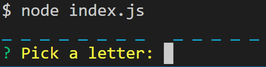
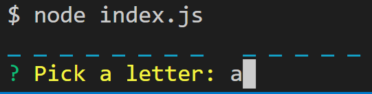
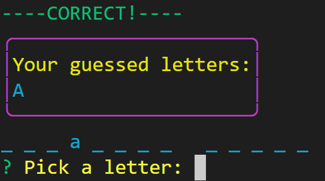
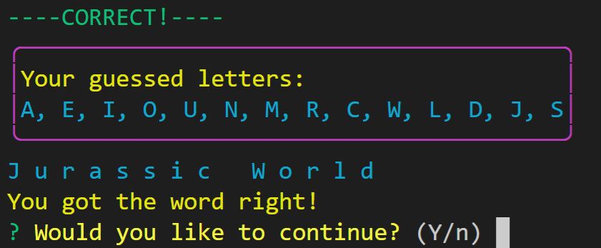
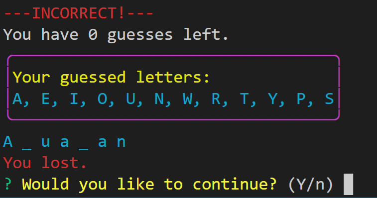

# Constructor Word Guess

A word guess game played using the CLI.

## Instructions

1. Start the game with the command `node index.js`.
  
2. When the game starts up, type a letter and press `Enter`.
  
3. If the letter is correct, it will be displayed on the puzzle.
  
4. Otherwise, the letter is incorrect and the number of guesses left decreases.
  
5. Once the puzzle has been solved or if you run out of guesses, then you can choose to play again.
   